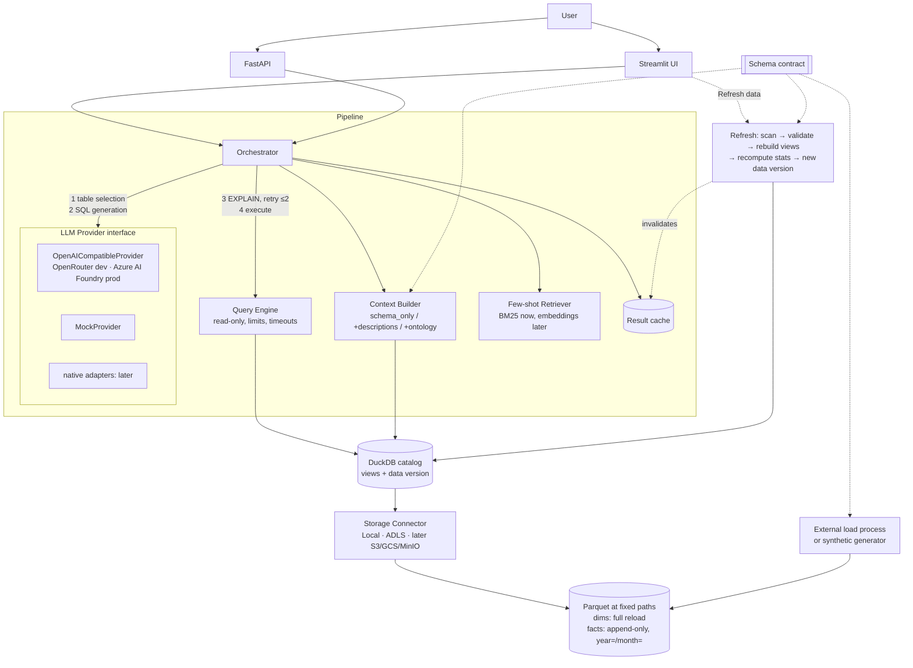

# Architecture

This is the target architecture; components get built phase by phase (see `PROGRESS.md`). It
reflects the decisions in `plans/phase-0.md` §3: loading is external and we only build refresh,
and the LLM layer is provider-agnostic.

