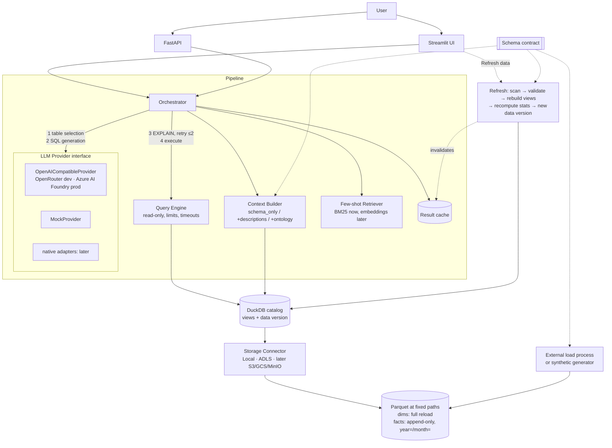
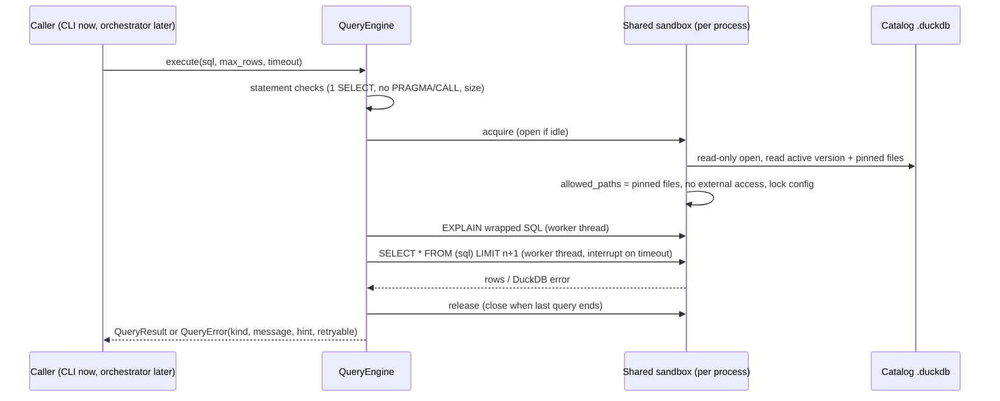

# Architecture

This is the target architecture; components get built phase by phase (see `PROGRESS.md`). It
reflects the decisions in `plans/phase-0.md` §3: loading is external and we only build refresh,
and the LLM layer is provider-agnostic.

## Component status

Keep this table current at the end of every phase.

| Component | Module | Phase | Status |
|---|---|---|---|
| Config (YAML + env + `local.yaml`), logging | `carquery.config`, `carquery.logging` | 0 | ✅ built |
| Schema contract, ER diagram | `config/schema_contract.yaml`, `carquery.contract` | 1 | ✅ built |
| Synthetic generator (history + day N, 8 planted patterns) | `carquery.generator` | 1 | ✅ built |
| Validation (schema, keys, ranges, FKs) | `carquery.validation` | 1 | ✅ built |
| Dataset definitions | `config/datasets.yaml`, `carquery.datasets` | 2 | ✅ built |
| Storage connector | `carquery.storage` (`LocalConnector`) | 2 | ✅ local · ⏸ ADLS deferred |
| Catalog (pinned views + state tables) | `carquery.catalog` | 2 | ✅ built |
| Refresh (scan → validate → activate → hooks) | `carquery.refresh` | 2 | ✅ built |
| Query engine (sandbox, limits, EXPLAIN, errors) | `carquery.query` | 3 | ✅ built |
| Context builder + ontology | — | 4 | planned |
| LLM providers, orchestrator, few-shot, result cache | — | 5 | planned |
| Evaluation harness | — | 6 | planned |
| Streamlit UI + FastAPI | — | 7 | planned |

## Query path as built (Phases 2–3)

Refresh (`carq refresh`) is the only writer. It waits while queries in the same process hold
the sandbox (the "different configuration" error is treated as busy), and it activates a new
version in one transaction. See `decisions.md` (D-20 … D-31) for why.
