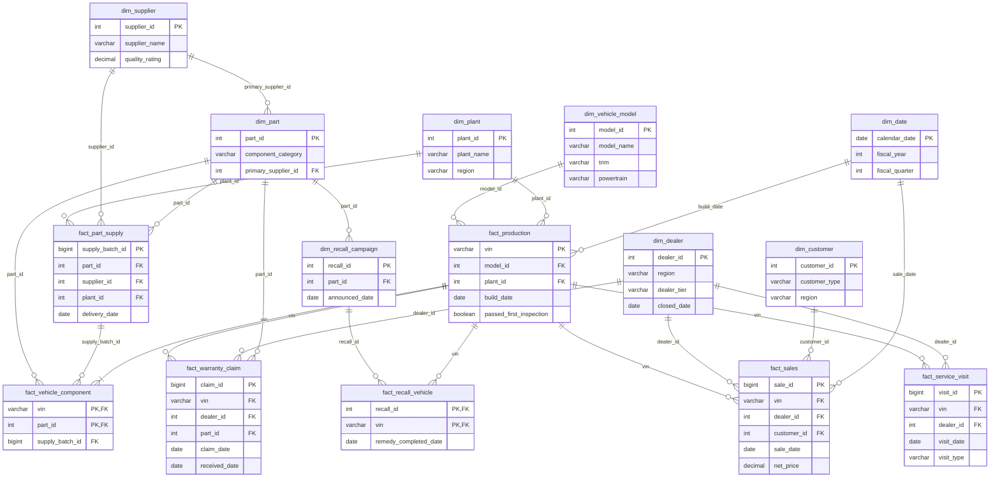

# Phase 1 Plan — Schema Contract, Synthetic Generator, Validation

Status: **approved 2026-09-21 — implemented** (changes from the plan: see PROGRESS.md, Phase 1)

## 1. Goal and scope

Produce a realistic, reproducible synthetic dataset at `small` scale that conforms to a single
schema contract, together with a validation module, a data profile, and tests showing that every
planted pattern can be found with SQL. The dataset exists to **showcase the PoC**. Where
fidelity and simplicity conflict, simplicity wins.

Decisions confirmed on 2026-09-21 (in addition to phase-0 §3):

| # | Topic | Decision |
|---|---|---|
| 1 | Extra planted patterns | Accepted: the BEV battery supplier/mileage pattern and the regional repair pattern (§5, P7–P8) |
| 2 | Late-arriving rows and state changes | Merging and restating rows is **upstream's job and out of scope**. The generator only emits rows. We don't write merge logic |
| 3 | Partitioning | **Off at `small` scale**, to avoid many small files. `year=/month=` is a per-table setting that is on only in the `medium`/`large` presets |
| 4 | `dim_date` | Generated, not derived from the facts |
| 5 | ER diagram | Added (§11) and also generated from the contract, so it can't drift (§9) |

Out of scope: storage connectors, the DuckDB catalog and `carq refresh` (Phase 2); any LLM work;
and running the `medium`/`large` presets (supported by design only).

## 2. New dependencies

| Package | Why |
|---|---|
| numpy | Vectorised, seeded random generation. This is the core of the generator |
| pyarrow | Arrow schemas from the contract, and parquet writing (ZSTD, row groups, streaming `ParquetWriter`) |
| duckdb | Validation checks, the data profile and the pattern tests, all as SQL over parquet. Phase 2 and later need it anyway |

**Not added:** pandas (numpy + pyarrow is enough, and generation stays memory-predictable) and
Faker (names come from small fictional lists in config, and there is no PII).

## 3. Schema contract — `config/schema_contract.yaml`

It's loaded by `carquery.contract` into pydantic models (`extra="forbid"`) and converted to
pyarrow schemas. It is the single source of truth for the generator, validation, the profile,
the ER diagram and (in Phase 4) the LLM context.

### 3.1 Format

```yaml
currency: EUR
tables:
  fact_sales:
    kind: fact                      # dimension | fact
    description: One row per vehicle sale ...
    grain: one row per sale transaction
    date_column: sale_date          # sort key and (if partitioned) partition source
    primary_key: [sale_id]
    columns:
      - name: sale_id
        type: BIGINT                # DuckDB type names; mapped to arrow types
        nullable: false
        description: ...
      - name: sale_type
        type: VARCHAR
        nullable: false
        allowed_values: [Retail, Fleet, Lease]
        description: ...
      - name: discount_amount
        type: DECIMAL(12,2)
        nullable: false
        min: 0
        unit: EUR
        description: ...
    foreign_keys:
      - {columns: [vin], references: fact_production.vin}
      - {columns: [sale_date], references: dim_date.calendar_date}
    checks:                          # row-level SQL boolean expressions, must hold for every row
      - {name: net_price_consistent, expr: "net_price = list_price - discount_amount"}
```

Supported types: `VARCHAR, BOOLEAN, SMALLINT, INTEGER, BIGINT, DOUBLE, DATE, DECIMAL(p,s)`.

### 3.2 Conventions

- Surrogate keys are `INTEGER` (`BIGINT` for high-volume facts). `vin` is a 17-character
  synthetic `VARCHAR`.
- Money is `DECIMAL(12,2)` in EUR, and every money column description says "EUR". Rates are
  `DECIMAL(6,4)`, stored as fractions (0.0350 = 3.5%).
- Categorical values are readable: `'Approved'`, `'BEV'`, `'Fleet'`.
- Join keys have the same name in every table. The one documented exception is
  `dim_date.calendar_date`, a role-playing date dimension that joins to `build_date`,
  `sale_date`, `claim_date` and the other date columns.
- **`fact_production` is also the vehicle register.** `vin` is its primary key, and every other
  fact's `vin` references it. There is no separate `dim_vehicle`. The ontology will say so
  (Phase 4).
- Geography hierarchy is `region → country → city`. Regions are European (single currency), e.g.
  *Northern Europe*, *Western Europe*, *Southern Europe*, *Central Europe*.

### 3.3 Final column lists

Changes from the brief are in **bold**.

**Dimensions**

| Table | Columns | Approx. rows (small) |
|---|---|---|
| `dim_date` | **calendar_date** PK, year, quarter, month, month_name, **year_month** ('2026-09'), week_of_year (ISO), day_of_week (1=Mon), **day_name**, is_weekend, fiscal_year (Apr 2025–Mar 2026 = 2026), fiscal_quarter (Q1 = Apr–Jun), **fiscal_year_label** ('FY2026') | ~1,800 |
| `dim_vehicle_model` | model_id PK, brand, model_name, trim, body_type, segment, powertrain (ICE/Hybrid/PHEV/BEV), engine_displacement_l (null for BEV), battery_kwh (null for ICE), range_km (electric range, null for ICE/Hybrid), fuel_consumption_l_per_100km (null for BEV), first_model_year, last_model_year (null = still in production), base_msrp. Grain is **model × trim** | ~40 |
| `dim_plant` | plant_id PK, plant_name, country, city, region, daily_capacity, opened_year | 5 |
| `dim_dealer` | dealer_id PK, dealer_name, country, city, region, dealer_tier (Flagship/Standard/Satellite), opened_date, **closed_date** (null if open), is_active | ~300 |
| `dim_customer` | customer_id PK, customer_type (Individual/Fleet), age_band (null for Fleet), country, city, region, first_purchase_date | ~38k |
| `dim_supplier` | supplier_id PK, supplier_name, country, supplier_tier (Tier 1/Tier 2), quality_rating (1.0–5.0) | ~40 |
| `dim_part` | part_id PK, part_name, component_category (Brakes/Powertrain/Battery/Electrical/Infotainment/Suspension/Body), unit_cost, primary_supplier_id FK → dim_supplier | ~60 |
| **`dim_recall_campaign`** | recall_id PK, campaign_name, component_category, **part_id** FK, announced_date, **remedy_description** | 2–4 |

**Facts**

| Table | Columns | Approx. rows (small) |
|---|---|---|
| `fact_production` | vin PK, model_id, plant_id, build_date, model_year, exterior_colour, production_cost, passed_first_inspection, rework_hours (0 when passed) | 50k |
| `fact_part_supply` | supply_batch_id PK, part_id, supplier_id, plant_id, delivery_date, quantity, unit_cost, inspected_defect_rate | ~40k |
| `fact_vehicle_component` | **PK (vin, part_id)**, supply_batch_id. There are 6 tracked key components per vehicle (brakes, battery or engine, electrical, infotainment, suspension, body) | ~300k |
| `fact_sales` | sale_id PK, vin, dealer_id, customer_id, sale_date, dealer_arrival_date, sale_type (Retail/Fleet/Lease), list_price, discount_amount, net_price, is_cancelled. A cancelled sale can be followed by a second sale of the same VIN | ~48k |
| `fact_service_visit` | visit_id PK, vin, dealer_id, visit_date, visit_type (Scheduled/Repair/Recall), odometer_km, labour_hours, total_cost, is_warranty | ~130k |
| `fact_warranty_claim` | claim_id PK, vin, dealer_id, part_id, claim_date, **received_date** (≥ claim_date; this is what makes a claim "late-arriving"), failure_mode, odometer_km, labour_cost, parts_cost, total_cost, claim_status (Approved/Rejected/Pending) | ~6k |
| **`fact_recall_vehicle`** | **PK (recall_id, vin)**, remedy_completed_date (null = not yet remedied). A remedy date matches a `Recall` service visit for that VIN | ~2k |

Row-level `checks` include: `net_price = list_price - discount_amount`,
`total_cost = labour_cost + parts_cost`, `received_date >= claim_date`,
`dealer_arrival_date <= sale_date`, and `rework_hours = 0 OR NOT passed_first_inspection`.

## 4. Generator

### 4.1 Config

- **`config/generator.yaml`** holds the seed, `end_date` (default `${GEN_END_DATE:-2026-08-31}`),
  `history_years` (3), the active preset and the preset definitions (`small` / `medium` /
  `large`, plus a tiny `test` preset for pytest). Each preset sets volumes, `chunk_months`, row
  group size and per-table partitioning. It also holds the distribution parameters and the
  planted pattern parameters (§5).
- **`config/synthetic_reference.yaml`** holds the fictional catalogue: brands, models, trims,
  plants, geography, supplier and part lists, failure modes and colours. Keeping it out of code
  satisfies "nothing hardcoded", and it can be edited without touching Python.

Both are loaded with `load_yaml(..., Model)`. The `--preset` and `--seed` CLI flags override
config.

### 4.2 Approach: one simulated timeline, sliced by date

The generator simulates a deterministic timeline from `history_start` to
`end_date + day_horizon_days` (default 60). What gets written depends on the "as-of" date:

- **History** writes every fact row whose *arrival date* is ≤ `end_date`. For most facts the
  arrival date is the event date. For warranty claims it is `received_date`.
- **`generate-day N`** writes only the fact rows whose arrival date is `end_date + N`. This
  includes late claims whose `claim_date` falls days or weeks earlier. It also rewrites every
  dimension as an as-of snapshot: dealers opened by then, `closed_date`/`is_active` as of then,
  and new trims whose `first_model_year` has started.

Why this works: the same seed always produces the same timeline, so day files never contradict
history, and no state has to be read back from disk. The cost is that each call re-simulates
everything. That takes seconds at `small` scale. For `medium`/`large` this is a Phase 8 topic.

Values are fixed when a row is created (`is_cancelled`, `claim_status`, `remedy_completed_date`
as of creation). Updating them later is upstream merge territory (decision 2), and it's listed
as a known limitation.

### 4.3 Simulation order (vectorised with numpy, per chunk of build months)

1. **Dimensions:** date, models, plants, dealers, suppliers and parts from reference data plus
   distributions.
2. **Production:** daily volume = plant capacity × seasonality × ramp-up. The model mix depends
   on plant and date, and BEV share per region drives what gets built.
3. **Part supply:** weekly batches per (part, plant) from the primary or secondary supplier.
4. **Vehicle components:** each vehicle takes the latest batch of each key part delivered to its
   plant before its build date.
5. **Sales:** transit time gives the dealer arrival date, and a dealer-specific days-to-sell
   gives the sale date. Also generated here: the customer (retail/fleet/lease mix, with fleet
   customers owning many vehicles), pricing and discounts, and cancellations with resale.
   Customers are created at their first purchase.
6. **Service visits:** annual mileage by customer type, scheduled visits every ~15,000 km or 12
   months, plus repair visits.
7. **Warranty claims:** a hazard per component × vehicle age × mileage, times the pattern
   multipliers. Also: the reporting lag (received_date), status, and costs.
8. **Recalls:** the campaign is announced after the brake pattern. The affected VINs come from
   the actual batch linkage, and remedies are spread as `Recall` service visits.

**Seeding:** a `numpy.random.SeedSequence(seed)` is split into a child stream per
(table, chunk). The output depends only on seed + config, not on execution order.

**Memory safety (for medium/large by design):** facts are built one chunk of build months at a
time and streamed to a `pyarrow.parquet.ParquetWriter`. Only compact per-vehicle state (vin,
model, plant, build date, sale date, customer type) is kept across chunks. At `large` scale
that's about 5M rows × ~40 bytes ≈ 200 MB.

### 4.4 Output layout (fixed paths under `paths.data_root`)

```
dim_dealer/dim_dealer.parquet                       # dimensions: overwritten on every run
fact_sales/fact_sales_history.parquet               # small: one file per fact table
fact_sales/fact_sales_2026-09-01.parquet            # generate-day 1 appends a file
fact_sales/year=2026/month=09/part-0.parquet        # medium/large when partitioning is on
ground_truth.yaml
```

- ZSTD compression. Rows are sorted by the table's `date_column`. The row group size comes from
  the preset (default 122,880, DuckDB's native size).
- The Phase 2 views glob `<table>/**/*.parquet`, so every layout is picked up.
- If hive columns are used, the partition values are *derived* from `date_column`, and the
  Phase 2 view hides the extra `year`/`month` columns. This is noted for Phase 2.
- `generate-history` refuses to write into a non-empty `data_root` unless given `--overwrite`.
- Files are written to a temporary name and then renamed, so a crash never leaves a half-written
  parquet file.

## 5. Planted patterns

The exact parameters live in `generator.yaml`. The generator resolves concrete IDs and writes
them to `<data_root>/ground_truth.yaml`, together with a **detection SQL** snippet and the
expected effect per pattern.

| # | Pattern | Default parameters |
|---|---|---|
| P1 | **Defective brake batch.** One supplier's front brake caliper batches delivered to one plant cause elevated claims, but only on vehicles built there in a ~6-week window. A recall follows | Claim rate ×6 within 18 months for affected VINs. Failure mode "Brake caliper seizure". Recall announced ~4 months after the window closes. ~75% remedied by end_date |
| P2 | **BEV share grows at different rates per region** (by dealer region) | Logistic curves. Northern Europe 8%→35%. Western Europe 5%→22%. Central Europe 3%→12%. Southern Europe 2%→8% |
| P3 | **Seasonality plus fiscal quarter-end spikes** | Monthly multipliers (spring peak, August and December dips). Sales in the last 10 days of each fiscal quarter (Jun, Sep, Dec, Mar) ×1.4 |
| P4 | **Slow dealers** | 8 dealers with mean days-to-sell ~95, against ~35 for the rest |
| P5 | **Line change hurts quality** | One plant × one model: first-inspection pass rate drops from ~94% to ~78% after a fixed date, and rework hours go up |
| P6 | **Fleet trade-off** | Fleet discounts 12–18% against retail 2–8%. Fleet vehicles average ~1.6× service visits per vehicle (higher annual mileage) |
| P7 | **BEV battery pack wear-out** *(new)* | One supplier's battery packs show a steep rise in Battery claims after 60,000 km or 24 months in service. Other suppliers' packs stay flat. It is only visible by joining claims → components → supplier and bucketing by odometer or age |
| P8 | **Regional suspension repairs** *(new)* | One SUV model has ~2.5× non-warranty Suspension repair visits at dealers in one region (poor roads or winter). The same model elsewhere and other models in that region look normal. It is only visible by combining model × dealer region × visit type |

The patterns are sized so that they stand out clearly at `small` scale, and P1 is kept
separate from the general brake baseline. They also don't mask each other. For example, P2
shifts BEV volume, but P7 is measured as a rate per BEV, so it isn't affected.

## 6. Realistic messiness

- **Nulls in non-key columns:** exterior_colour ~1%, service odometer_km ~2%, age_band ~3% of
  individuals, failure_mode ~2%, inspected_defect_rate ~1%. Every nullable column is declared
  nullable in the contract.
- **Late-arriving claims:** `received_date − claim_date` follows a long-tailed lag (most within
  a week, ~5% after 30+ days).
- **Business outcomes:** ~2% of sales cancelled (most VINs are later resold), ~12% of claims
  rejected, and recent claims can still be `Pending`.
- **Closed dealers:** ~4% of dealers close during the window, and they have no sales or services
  after `closed_date`.
- **Unsold inventory:** vehicles built in the last weeks are mostly unsold at end_date.
- Referential integrity always holds. There are no deliberate foreign key violations. Messiness
  shows up in values, not in broken keys, so it can't be confused with generator bugs.
- **Known artefact:** the history starts "cold", so service and claim volumes ramp up during the
  first year. This is realistic for a new vehicle population. Golden questions (Phase 6) will
  use rates.

## 7. Validation — `carquery.validation`

`validate(data_root, contract) -> ValidationReport` runs DuckDB SQL over
`read_parquet('<table>/**/*.parquet')`:

1. **Schema:** column set and types match the contract (column order is ignored), and no tables
   are missing or extra.
2. **Primary key** is unique and not null.
3. **Not-null** holds for `nullable: false` columns.
4. **Foreign keys:** a count of orphan rows per foreign key.
5. **Allowed values / min / max.**
6. **Row-level `checks` expressions.**

The report is a list of `Issue(table, check, severity, message, failing_rows, sample)`, with a
pass/fail result and a plain-text rendering. Phase 2's refresh will call the same function.

## 8. CLI

A `generate` sub-app is added to `carquery/cli.py`:

```bash
carq generate history [--preset small] [--seed 42] [--overwrite]   # writes, then validates
carq generate day N  [--preset small] [--seed 42]                  # writes day end_date+N, validates
carq validate                                                      # exit 1 on errors
carq profile [--out docs/data_profile.md]
carq schema erd [--out docs/schema.md]                            # Mermaid ER diagram from the contract
```

## 9. Data profile and ER diagram

- **`docs/data_profile.md`** (committed, generated by `carq profile`) contains row counts, null
  rates per column, top values for categorical columns, min/max/mean for numeric columns, date
  ranges, and the dataset fingerprint (seed, preset, end_date).
- **`docs/schema.md`** (committed, generated by `carq schema erd`) contains a Mermaid
  `erDiagram` built from the contract, plus a per-table column list with descriptions. Because
  it's generated, the diagram always matches the contract. A test checks that the committed file
  is up to date.

**Ways to view the table layout:**

1. **GitHub** renders Mermaid in markdown natively, so `docs/schema.md` just displays as a
   diagram.
2. **VS Code:** the built-in Markdown preview with the "Markdown Preview Mermaid Support"
   extension.
3. **https://mermaid.live:** paste the diagram for an interactive, zoomable view and export to
   PNG/SVG.
4. Optional later: DBML export for dbdiagram.io (drag-able layout) is roughly 30 lines of code
   if you want it.

## 10. Files and tests

```
config/schema_contract.yaml, config/generator.yaml, config/synthetic_reference.yaml
src/carquery/contract.py            # models, loader, arrow schema, mermaid rendering
src/carquery/generator/
    __init__.py  config.py  reference.py  timeline.py (slicing/as-of)
    dimensions.py  production.py  supply.py  sales.py  aftersales.py
    patterns.py (parameter resolution + ground truth)  writer.py
src/carquery/validation.py
src/carquery/profile.py
tests/test_contract.py test_generator.py test_validation.py test_patterns.py test_cli_generate.py
```

**Tests:**

- The contract loads, every foreign key targets an existing primary key, and the arrow schema is
  built correctly.
- **Determinism:** the same seed produces byte-identical parquet, and a different seed produces
  different data.
- Generated output passes validation.
- Validation catches problems in deliberately corrupted fixtures: a duplicate primary key, an
  orphan foreign key, a null in a non-null column, a bad enum value, a failed check, and a wrong
  column type.
- **History + day N consistency:** the history plus days 1..3 equals the timeline sliced to
  end_date + 3, and every day file passes validation together with the history.
- **Pattern tests (P1–P8):** the `test` preset (about 10k vehicles, 3 years) is generated once
  per session, and each pattern's detection SQL must show the planted effect beyond a stated
  threshold. For example, the P1 affected claim rate is ≥ 3× the baseline, and the P2 slope for
  Northern Europe is greater than for Southern Europe.
- The ER doc is up to date. The CLI smoke tests pass.

Target: the full test suite runs in under ~60 seconds. If pattern tests turn out slow, they get
a `slow` marker that is still included in the default run.

## 11. ER diagram

Only key columns are shown here, to keep it readable. `docs/schema.md` will have the full,
generated version. `dim_date` joins to every date column (a role-playing dimension). Only two of
those links are drawn.



## 12. Open questions (defaults in bold; I proceed with the default unless you say otherwise)

1. **`ground_truth.yaml` location.** The brief says `data/ground_truth.yaml`. I'll write it to
   `<data_root>/ground_truth.yaml`, which is gitignored because it depends on seed and preset.
   The committed source of truth is the pattern config in `generator.yaml`. Alternative: commit
   a copy for the `small` preset.
2. **Default `end_date` = 2026-08-31.** That gives FY2025 and FY2026 in full, plus partial fiscal
   years at both ends. Useful for "full fiscal year" versus "year-to-date" questions.
3. **Fictional brand and place names.** Two fictional brands (e.g. "Aurelia", "Veltra") and real
   European countries and cities. There are no real manufacturer or dealer names.
4. **The `test` preset runs inside pytest** (a few seconds). It is not a committed fixture
   dataset.

## 13. Definition of done

`carq generate history` produces the `small` dataset and it passes validation.
`carq generate day 1` appends valid files. The `docs/data_profile.md` and `docs/schema.md` files
are generated and committed. `uv run pytest` is green, including the pattern tests. Ruff is
clean. README, CLAUDE.md (new commands) and `docs/PROGRESS.md` are updated. Then one commit.
