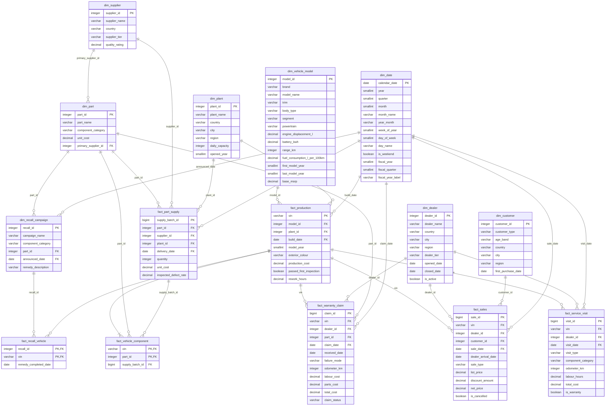

# Data schema

<!-- Generated by `carq schema erd` from config/schema_contract.yaml. Do not edit. -->

Star schema for the car manufacturer PoC. All money is in EUR. `dim_date.calendar_date` is a role-playing date dimension: join it to any date column. `fact_production` is also the vehicle register (one row per `vin`).

## `dim_date` (dimension)

Calendar with calendar and fiscal attributes. The fiscal year starts on 1 April and is named after the calendar year it ends in (1 Apr 2025 to 31 Mar 2026 = FY2026). A role-playing dimension: join calendar_date to any date column (build_date, sale_date, claim_date, visit_date, delivery_date, ...).

Grain: one row per calendar day. Primary key: `calendar_date`.

| Column | Type | Null | Description |
|---|---|---|---|
| `calendar_date` | DATE | no | The calendar day. |
| `year` | SMALLINT | no | Calendar year. |
| `quarter` | SMALLINT | no | Calendar quarter (1 = Jan-Mar). |
| `month` | SMALLINT | no | Calendar month number. |
| `month_name` | VARCHAR | no | Full English month name, e.g. 'September'. |
| `year_month` | VARCHAR | no | Calendar year and month as 'YYYY-MM', e.g. '2026-09'. |
| `week_of_year` | SMALLINT | no | ISO 8601 week number. |
| `day_of_week` | SMALLINT | no | ISO day of week (1 = Monday, 7 = Sunday). |
| `day_name` | VARCHAR | no | Full English day name, e.g. 'Monday'. |
| `is_weekend` | BOOLEAN | no | True on Saturday and Sunday. |
| `fiscal_year` | SMALLINT | no | Fiscal year number; the fiscal year starts 1 April and is named after the year it ends in (Apr 2025-Mar 2026 = 2026). |
| `fiscal_quarter` | SMALLINT | no | Fiscal quarter (1 = Apr-Jun, 2 = Jul-Sep, 3 = Oct-Dec, 4 = Jan-Mar). |
| `fiscal_year_label` | VARCHAR | no | Fiscal year label, e.g. 'FY2026'. |

## `dim_vehicle_model` (dimension)

Vehicle models and trims offered by the manufacturer's brands, with powertrain and technical attributes and the base list price.

Grain: one row per model and trim. Primary key: `model_id`.

| Column | Type | Null | Description |
|---|---|---|---|
| `model_id` | INTEGER | no | Surrogate key of the model and trim. |
| `brand` | VARCHAR | no | Brand name. |
| `model_name` | VARCHAR | no | Model name (without trim). |
| `trim` | VARCHAR | no | Trim level (variant), e.g. 'Base', 'Sport'. |
| `body_type` | VARCHAR | no | Body style. Values: `Hatchback`, `Sedan`, `Estate`, `SUV`, `Van`. |
| `segment` | VARCHAR | no | Market segment. Values: `Compact`, `Midsize`, `Large`, `Commercial`. |
| `powertrain` | VARCHAR | no | Powertrain: ICE (combustion only), Hybrid, PHEV (plug-in hybrid) or BEV (battery electric vehicle, 'EV'). Values: `ICE`, `Hybrid`, `PHEV`, `BEV`. |
| `engine_displacement_l` | DECIMAL(3,1) | yes | Engine displacement in litres; NULL for BEV. |
| `battery_kwh` | DECIMAL(5,1) | yes | Battery capacity in kWh; NULL for ICE. |
| `range_km` | INTEGER | yes | Electric-only range in km (WLTP); NULL for ICE and Hybrid. |
| `fuel_consumption_l_per_100km` | DECIMAL(4,1) | yes | Combined fuel consumption in litres per 100 km; NULL for BEV. |
| `first_model_year` | SMALLINT | no | First model year this trim is offered. |
| `last_model_year` | SMALLINT | yes | Last model year offered; NULL while still in production. |
| `base_msrp` | DECIMAL(12,2) | no | Base manufacturer's suggested retail price in EUR. |

## `dim_plant` (dimension)

Vehicle assembly plants.

Grain: one row per plant. Primary key: `plant_id`.

| Column | Type | Null | Description |
|---|---|---|---|
| `plant_id` | INTEGER | no | Surrogate key of the plant. |
| `plant_name` | VARCHAR | no | Plant name. |
| `country` | VARCHAR | no | Country where the plant is located. |
| `city` | VARCHAR | no | City where the plant is located. |
| `region` | VARCHAR | no | Geographic region of the plant (region > country > city). |
| `daily_capacity` | INTEGER | no | Nominal number of vehicles the plant can build per working day. |
| `opened_year` | SMALLINT | no | Year the plant opened. |

## `dim_dealer` (dimension)

Dealers (retailers) that sell and service vehicles. Some dealers closed during the history; they keep their rows with is_active = false and a closed_date.

Grain: one row per dealer. Primary key: `dealer_id`.

| Column | Type | Null | Description |
|---|---|---|---|
| `dealer_id` | INTEGER | no | Surrogate key of the dealer. |
| `dealer_name` | VARCHAR | no | Dealer trading name. |
| `country` | VARCHAR | no | Country of the dealer. |
| `city` | VARCHAR | no | City of the dealer. |
| `region` | VARCHAR | no | Geographic region of the dealer (region > country > city). |
| `dealer_tier` | VARCHAR | no | Dealer size / format tier. Values: `Flagship`, `Standard`, `Satellite`. |
| `opened_date` | DATE | no | Date the dealer opened. |
| `closed_date` | DATE | yes | Date the dealer closed; NULL if still open. |
| `is_active` | BOOLEAN | no | True if the dealer is currently open. |

## `dim_customer` (dimension)

Buyers of vehicles: individuals or fleet (company) customers. Contains no personal data such as names.

Grain: one row per customer. Primary key: `customer_id`.

| Column | Type | Null | Description |
|---|---|---|---|
| `customer_id` | INTEGER | no | Surrogate key of the customer. |
| `customer_type` | VARCHAR | no | Individual (private buyer) or Fleet (company buying several vehicles). Values: `Individual`, `Fleet`. |
| `age_band` | VARCHAR | yes | Age band of an individual customer; NULL for fleet customers and where unknown. Values: `18-24`, `25-34`, `35-44`, `45-54`, `55-64`, `65+`. |
| `country` | VARCHAR | no | Country of the customer. |
| `city` | VARCHAR | no | City of the customer. |
| `region` | VARCHAR | no | Geographic region of the customer (region > country > city). |
| `first_purchase_date` | DATE | no | Date of the customer's first vehicle purchase. |

## `dim_supplier` (dimension)

Suppliers of vehicle parts.

Grain: one row per supplier. Primary key: `supplier_id`.

| Column | Type | Null | Description |
|---|---|---|---|
| `supplier_id` | INTEGER | no | Surrogate key of the supplier. |
| `supplier_name` | VARCHAR | no | Supplier company name. |
| `country` | VARCHAR | no | Country of the supplier. |
| `supplier_tier` | VARCHAR | no | Supply-chain tier (Tier 1 delivers directly to the plants). Values: `Tier 1`, `Tier 2`. |
| `quality_rating` | DECIMAL(2,1) | no | Supplier quality rating from 1.0 (poor) to 5.0 (excellent). |

## `dim_part` (dimension)

Tracked key parts (not a full bill of materials) with their component category and primary supplier.

Grain: one row per part. Primary key: `part_id`.

| Column | Type | Null | Description |
|---|---|---|---|
| `part_id` | INTEGER | no | Surrogate key of the part. |
| `part_name` | VARCHAR | no | Part name. |
| `component_category` | VARCHAR | no | Component category of the part. Values: `Brakes`, `Powertrain`, `Battery`, `Electrical`, `Infotainment`, `Suspension`, `Body`. |
| `unit_cost` | DECIMAL(12,2) | no | Standard unit cost in EUR. |
| `primary_supplier_id` | INTEGER | no | The part's main supplier. |

Foreign keys: `primary_supplier_id` → `dim_supplier.supplier_id`.

## `dim_recall_campaign` (dimension)

Recall campaigns announced by the manufacturer for a specific part.

Grain: one row per recall campaign. Primary key: `recall_id`.

| Column | Type | Null | Description |
|---|---|---|---|
| `recall_id` | INTEGER | no | Surrogate key of the recall campaign. |
| `campaign_name` | VARCHAR | no | Campaign name / reference. |
| `component_category` | VARCHAR | no | Component category affected by the recall. Values: `Brakes`, `Powertrain`, `Battery`, `Electrical`, `Infotainment`, `Suspension`, `Body`. |
| `part_id` | INTEGER | no | The part being recalled. |
| `announced_date` | DATE | no | Date the recall was announced. |
| `remedy_description` | VARCHAR | no | What dealers do to remedy an affected vehicle. |

Foreign keys: `part_id` → `dim_part.part_id`; `announced_date` → `dim_date.calendar_date`.

## `fact_production` (fact)

Every vehicle built, one row per VIN. This is also the vehicle register: every other table's vin refers to it.

Grain: one row per vehicle (VIN). Primary key: `vin`.

| Column | Type | Null | Description |
|---|---|---|---|
| `vin` | VARCHAR | no | Vehicle identification number (17 characters). |
| `model_id` | INTEGER | no | Model and trim built. |
| `plant_id` | INTEGER | no | Plant that built the vehicle. |
| `build_date` | DATE | no | Date the vehicle was built. |
| `model_year` | SMALLINT | no | Model year of the vehicle (differs from the build year for vehicles built in the second half of the year). |
| `exterior_colour` | VARCHAR | yes | Exterior paint colour; NULL where not recorded. |
| `production_cost` | DECIMAL(12,2) | no | Total cost to build the vehicle in EUR. |
| `passed_first_inspection` | BOOLEAN | no | True if the vehicle passed end-of-line quality inspection the first time. |
| `rework_hours` | DECIMAL(5,1) | no | Hours of rework needed after a failed first inspection; 0 when it passed. |

Foreign keys: `model_id` → `dim_vehicle_model.model_id`; `plant_id` → `dim_plant.plant_id`; `build_date` → `dim_date.calendar_date`.

## `fact_part_supply` (fact)

Deliveries of part batches from suppliers to plants, with incoming inspection results.

Grain: one row per delivered supply batch. Primary key: `supply_batch_id`.

| Column | Type | Null | Description |
|---|---|---|---|
| `supply_batch_id` | BIGINT | no | Identifier of the delivered batch. |
| `part_id` | INTEGER | no | Part delivered. |
| `supplier_id` | INTEGER | no | Supplier that delivered the batch. |
| `plant_id` | INTEGER | no | Receiving plant. |
| `delivery_date` | DATE | no | Date the batch was delivered. |
| `quantity` | INTEGER | no | Number of units in the batch. |
| `unit_cost` | DECIMAL(12,2) | no | Price paid per unit in EUR. |
| `inspected_defect_rate` | DECIMAL(6,4) | yes | Share of sampled units found defective at incoming inspection (0.0100 = 1%); NULL if not inspected. |

Foreign keys: `part_id` → `dim_part.part_id`; `supplier_id` → `dim_supplier.supplier_id`; `plant_id` → `dim_plant.plant_id`; `delivery_date` → `dim_date.calendar_date`.

## `fact_vehicle_component` (fact)

Traceability of key components: which supply batch each tracked part in a vehicle came from. Covers about six key components per vehicle, not a full bill of materials.

Grain: one row per vehicle and tracked part. Primary key: `vin, part_id`.

| Column | Type | Null | Description |
|---|---|---|---|
| `vin` | VARCHAR | no | Vehicle. |
| `part_id` | INTEGER | no | Tracked part fitted to the vehicle. |
| `supply_batch_id` | BIGINT | no | Supply batch the fitted part came from. |

Foreign keys: `vin` → `fact_production.vin`; `part_id` → `dim_part.part_id`; `supply_batch_id` → `fact_part_supply.supply_batch_id`.

## `fact_sales` (fact)

Vehicle sales to customers through dealers. A cancelled sale stays in the table with is_cancelled = true; the vehicle may be sold again later under a new sale_id. Units sold normally exclude cancelled sales.

Grain: one row per sale transaction. Primary key: `sale_id`.

| Column | Type | Null | Description |
|---|---|---|---|
| `sale_id` | BIGINT | no | Identifier of the sale. |
| `vin` | VARCHAR | no | Vehicle sold. |
| `dealer_id` | INTEGER | no | Selling dealer. |
| `customer_id` | INTEGER | no | Buying customer. |
| `sale_date` | DATE | no | Date of the sale (contract signed). |
| `dealer_arrival_date` | DATE | no | Date the vehicle arrived at the dealer; days-to-sell = sale_date - dealer_arrival_date. |
| `sale_type` | VARCHAR | no | Retail (private purchase), Fleet (company purchase) or Lease. Values: `Retail`, `Fleet`, `Lease`. |
| `list_price` | DECIMAL(12,2) | no | List price of the vehicle in EUR. |
| `discount_amount` | DECIMAL(12,2) | no | Discount given in EUR. |
| `net_price` | DECIMAL(12,2) | no | Price actually paid in EUR (list_price - discount_amount); net revenue is the sum of net_price over non-cancelled sales. |
| `is_cancelled` | BOOLEAN | no | True if the sale was cancelled. |

Foreign keys: `vin` → `fact_production.vin`; `dealer_id` → `dim_dealer.dealer_id`; `customer_id` → `dim_customer.customer_id`; `sale_date` → `dim_date.calendar_date`.

## `fact_service_visit` (fact)

Workshop visits of sold vehicles at dealers (scheduled maintenance, repairs and recall work).

Grain: one row per service visit. Primary key: `visit_id`.

| Column | Type | Null | Description |
|---|---|---|---|
| `visit_id` | BIGINT | no | Identifier of the visit. |
| `vin` | VARCHAR | no | Vehicle serviced. |
| `dealer_id` | INTEGER | no | Dealer workshop that did the work. |
| `visit_date` | DATE | no | Date of the visit. |
| `visit_type` | VARCHAR | no | Scheduled maintenance, Repair (unplanned) or Recall (recall remedy). Values: `Scheduled`, `Repair`, `Recall`. |
| `component_category` | VARCHAR | yes | Component category worked on in a Repair or Recall visit; NULL for Scheduled maintenance. Values: `Brakes`, `Powertrain`, `Battery`, `Electrical`, `Infotainment`, `Suspension`, `Body`. |
| `odometer_km` | INTEGER | yes | Odometer reading in km; NULL where not recorded. |
| `labour_hours` | DECIMAL(5,1) | no | Labour hours spent. |
| `total_cost` | DECIMAL(12,2) | no | Total cost of the visit in EUR (labour and parts). |
| `is_warranty` | BOOLEAN | no | True if the cost is covered by the manufacturer (warranty or recall). |

Foreign keys: `vin` → `fact_production.vin`; `dealer_id` → `dim_dealer.dealer_id`; `visit_date` → `dim_date.calendar_date`.

## `fact_warranty_claim` (fact)

Warranty claims filed by dealers for failed parts. Claims can reach the manufacturer late: received_date is when the claim arrived, claim_date when the failure was reported at the dealer.

Grain: one row per warranty claim. Primary key: `claim_id`.

| Column | Type | Null | Description |
|---|---|---|---|
| `claim_id` | BIGINT | no | Identifier of the claim. |
| `vin` | VARCHAR | no | Vehicle with the failure. |
| `dealer_id` | INTEGER | no | Dealer that filed the claim. |
| `part_id` | INTEGER | no | Failed part. |
| `claim_date` | DATE | no | Date the failure was reported at the dealer. |
| `received_date` | DATE | no | Date the claim reached the manufacturer (on or after claim_date). |
| `failure_mode` | VARCHAR | yes | Description of how the part failed; NULL where not recorded. |
| `odometer_km` | INTEGER | no | Odometer reading in km at the time of the failure. |
| `labour_cost` | DECIMAL(12,2) | no | Labour cost claimed in EUR. |
| `parts_cost` | DECIMAL(12,2) | no | Parts cost claimed in EUR. |
| `total_cost` | DECIMAL(12,2) | no | Total claimed cost in EUR (labour_cost + parts_cost). |
| `claim_status` | VARCHAR | no | Approved, Rejected or Pending (not yet decided). Warranty cost normally counts approved claims only. Values: `Approved`, `Rejected`, `Pending`. |

Foreign keys: `vin` → `fact_production.vin`; `dealer_id` → `dim_dealer.dealer_id`; `part_id` → `dim_part.part_id`; `claim_date` → `dim_date.calendar_date`.

## `fact_recall_vehicle` (fact)

Vehicles affected by a recall campaign and whether the remedy has been done (remedy_completed_date is NULL until then).

Grain: one row per recall campaign and affected vehicle. Primary key: `recall_id, vin`.

| Column | Type | Null | Description |
|---|---|---|---|
| `recall_id` | INTEGER | no | Recall campaign. |
| `vin` | VARCHAR | no | Affected vehicle. |
| `remedy_completed_date` | DATE | yes | Date the remedy was done at a dealer; NULL if not yet remedied. |

Foreign keys: `recall_id` → `dim_recall_campaign.recall_id`; `vin` → `fact_production.vin`.
